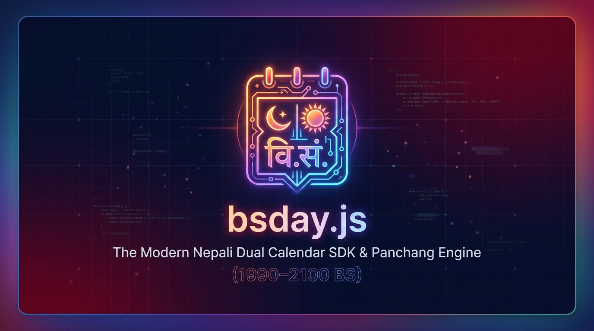

<p align="center">
  
</p>

# 🇳🇵 bsday.js

> **The ultra-fast, zero-bloat, Day.js-compatible dual calendar (Bikram Sambat ↔ Gregorian) SDK and astronomical Panchang engine for the modern Nepali software ecosystem.**

[](https://bsdayjs.vercel.app)
[](https://www.npmjs.com/package/@bsday.js/core)
[](https://bundlephobia.com/package/@bsday.js/core)
[](https://www.typescriptlang.org)
[](./LICENSE)
[](https://vitest.dev)

🌐 **Official Website & Playground**: [https://bsdayjs.vercel.app](https://bsdayjs.vercel.app)  
📖 **Interactive Documentation**: [https://bsdayjs.vercel.app/docs](https://bsdayjs.vercel.app/docs)  
📅 **Calendar & Panchang Explorer**: [https://bsdayjs.vercel.app/calendar](https://bsdayjs.vercel.app/calendar)

`bsday.js` is designed from the ground up for Nepali web applications, fintech, banking, tax accounting, and calendar UI. It provides seamless **Day.js API parity**, **Vedic/Hindu Panchang accuracy (Hamro Patro & Panchang Nirnayak Samiti Parity)**, **Fiscal Year (आर्थिक वर्ष) engine**, **KYC chronological age calculation**, **headless calendar grid generation**, and **Zod/Form validation**.

---

## 📦 Packages

| Package | Version | Description |
| :--- | :---: | :--- |
| **[@bsday.js/core](./packages/core)** | `1.1.0` | Ultra-fast (< 5KB), zero-dependency dual calendar SDK with Day.js syntax parity. |
| **[@bsday.js/dataset](./packages/dataset)** | `1.1.0` | 111-Year (1990–2100 BS / 40,543 days) astronomical Panchang & Nepali festival dataset. |

---

## ⚡ Performance & Benchmark Highlights

Tested on Node.js v24 (macOS ARM64, 200,000 operations each):

| Benchmark Operation | Throughput (ops/sec) | Avg Latency |
|---|---|---|
| **BS ➔ AD Date Conversion** | **~483,000 ops/sec** | `2.0 μs` |
| **AD ➔ BS Date Conversion** | **~281,000 ops/sec** | `3.5 μs` |
| **Fiscal Year (आर्थिक वर्ष) Engine** | **~207,000 ops/sec** | `4.8 μs` |
| **KYC Chronological Age Calculation** | **~157,000 ops/sec** | `6.3 μs` |
| **Full Date Formatting (`format`)** | **~125,000 ops/sec** | `8.0 μs` |
| **Headless Calendar Matrix (42 cells/grid)** | **~1,200 grids/sec** | `0.8 ms` |

---

## 📦 Installation

```bash
# Core SDK (Zero dependencies, < 5KB)
npm install @bsday.js/core
# or
pnpm add @bsday.js/core
# or
yarn add @bsday.js/core
```

*(Optional)* For Vedic Panchang, Tithi, Nakshatra, and Nepali public holidays across 111 years (1990–2100 BS):
```bash
npm install @bsday.js/dataset
```

---

## 🚀 Quickstart & Common Use Cases

### 1. Basic Date Creation & Formatting
```typescript
import { bsday, BSDay } from '@bsday.js/core';

// Current Date
const today = bsday();

// Create explicit BS Date (1-indexed months: 1=Baisakh, 5=Bhadra)
const bs = bsday.bs(2081, 5, 15);
console.log(bs.format('YYYY/MM/DD')); // "2081/05/15"

// Localized Nepali Numerals & Month Names
console.log(bs.locale('ne').format('YYYY MMMM DD, dddd'));
// "२०८१ भाद्र १५, आइतबार"

// Bracket literal escaping
console.log(bs.format('YYYY [साल] MMMM [महिना] DD [गते]'));
// "2081 साल Bhadra महिना 15 गते"
```

---

### 2. BS ↔ AD Dual-Calendar Conversion
```typescript
// BS to AD
const bs = bsday.bs('2081/06/27');
const ad = bs.toAD(); // Native JavaScript Date: 2024-10-13T00:00:00.000Z
console.log(ad.toISOString());

// AD to BS
const fromGregorian = bsday('2024-10-13');
console.log(fromGregorian.format('YYYY/MM/DD')); // "2081/06/27"
```

---

### 3. Date Arithmetic & Manipulation (Day.js Parity)
```typescript
const date = bsday.bs(2081, 5, 15);

// Add & Subtract
const nextMonth = date.add(1, 'month');
const prevWeek = date.subtract(7, 'day');

// Start / End of Units
const startOfMonth = date.startOf('month'); // 2081/05/01 00:00:00.000
const endOfMonth = date.endOf('month');     // 2081/05/31 23:59:59.999

// Comparison
date.isBefore(nextMonth);         // true
date.isSameOrAfter(date, 'date'); // true
date.diff(bsday.bs(2080, 5, 15), 'year'); // 1
```

---

### 4. Nepali Fiscal Year (आर्थिक वर्ष) Engine
Nepali Fiscal Year runs from **Shrawan 1 (Month 4)** to **Ashadh end (Month 3 next year)**:

```typescript
const invoiceDate = bsday.bs(2081, 5, 10);

console.log(invoiceDate.fiscalYear('short'));    // "2081/82"
console.log(invoiceDate.fiscalYear('full'));     // "2081/2082"
console.log(invoiceDate.fiscalYear('extended')); // "FY 2081/82"

// Localized in Nepali
console.log(invoiceDate.locale('ne').fiscalYear('extended'));
// "आ.व. २०८१/८२"

// Fiscal Quarters (Q1: Shrawan-Ashwin, Q2: Kartik-Poush, Q3: Magh-Chaitra, Q4: Baisakh-Ashadh)
console.log(invoiceDate.fiscalQuarter()); // 1

// Start & End of Fiscal Year
const fyStart = invoiceDate.startOf('fiscalYear'); // 2081/04/01 00:00:00.000
const fyEnd = invoiceDate.endOf('fiscalYear');     // 2082/03/31 23:59:59.999
```

---

### 5. KYC & Chronological Age Calculation
Accurately accounts for irregular Bikram Sambat month lengths without day drift:

```typescript
const birthDate = bsday.bs(2057, 5, 15);
const asOfDate = bsday.bs(2081, 8, 20);

// Chronological breakdown
console.log(birthDate.age(asOfDate));
// { years: 24, months: 3, days: 5 }

// Formatted strings
console.log(birthDate.formatAge('en', asOfDate)); // "24 years, 3 months, 5 days"
console.log(birthDate.formatAge('ne', asOfDate)); // "२४ वर्ष, ३ महिना, ५ दिन"

// Fast Adult / KYC Verification
console.log(birthDate.isAdult(18)); // true
```

---

### 6. Headless Calendar Grid Generator (For UI / DatePickers)
Build custom React, Vue, or Vanilla JS Nepali DatePickers with one line:

```typescript
import { getCalendarMatrix } from '@bsday.js/core';

const matrix = getCalendarMatrix(2083, 7, {
  locale: 'ne',
  minDate: '2083/07/01',
  maxDate: '2083/07/30',
  fixedWeeks: true, // Guarantees 6 rows (42 cells) for steady UI
});
```

---

### 7. Form & Schema Validation (Zod & React Hook Form)
```typescript
import { validateBSDateString } from '@bsday.js/core';
import { z } from 'zod';

const formSchema = z.object({
  dobBS: z.string().refine((val) => {
    const res = validateBSDateString(val, { minYear: 1990, maxYear: 2100 });
    return res.isValid;
  }, {
    message: 'Invalid Nepali BS Date (Expected: YYYY/MM/DD)',
  }),
});
```

---

## 📚 Guides & Framework Recipes

* 🔄 [Migrating from `nepali-date-converter`, `bikram-sambat-js`, & `nepali-datetime`](./docs/migration-guide.md)
* ⚡ [Next.js (App Router & SSR) Integration Recipe](./docs/recipes/nextjs-app-router.md)
* 📋 [React Hook Form + Zod BS Date Validation Recipe](./docs/recipes/react-hook-form-zod.md)
* 🎨 [Accessible React + Tailwind CSS Headless DatePicker Component](./docs/recipes/headless-react-datepicker.md)
* 🗄️ [Database & Prisma PostgreSQL UTC/BS Integration Recipe](./docs/recipes/prisma-postgres.md)
* 📖 [Full API Specification & Architecture](./docs/api-design.md)

---

## 📄 License

MIT © [shurajcodx](https://github.com/shurajcodx)
